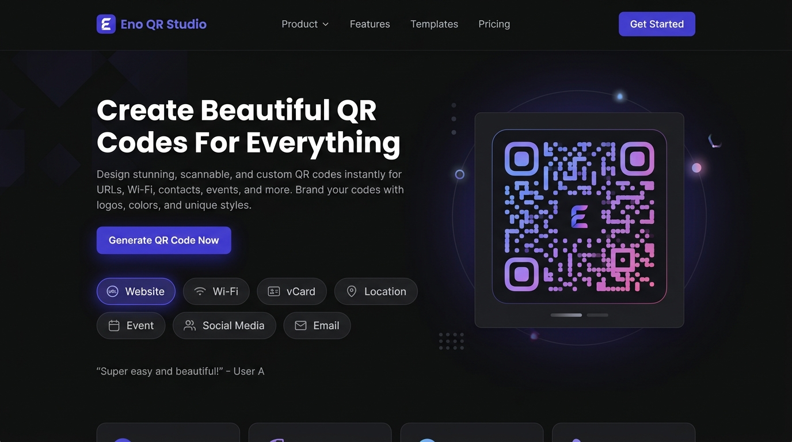
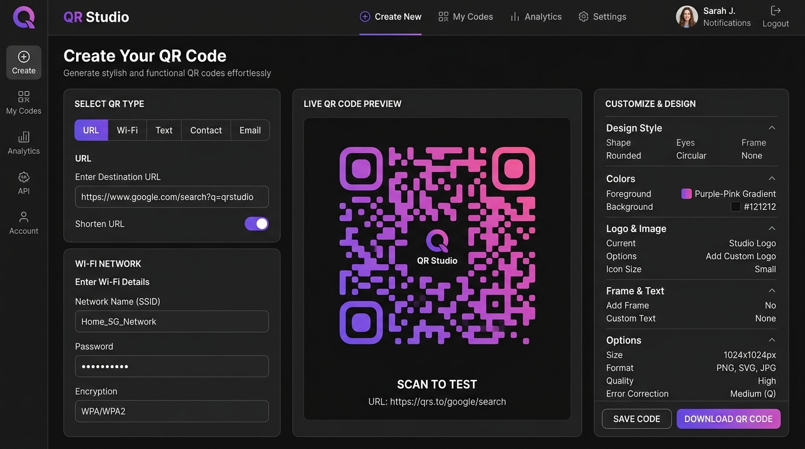
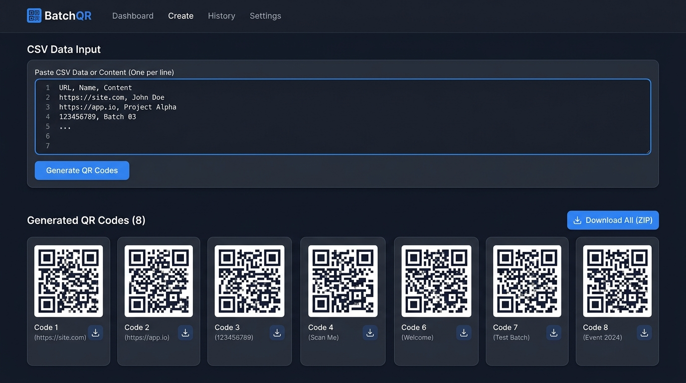
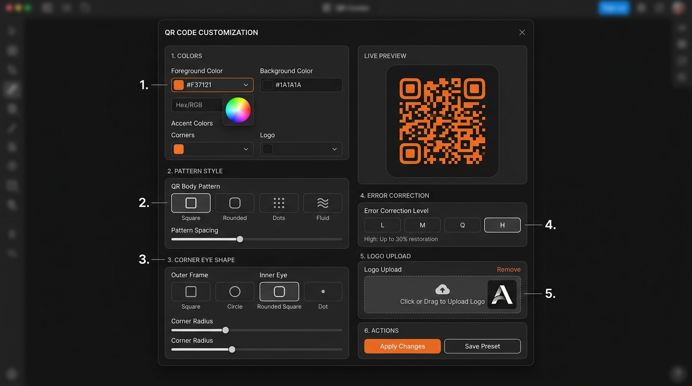

# Eno QR Studio

A high-performance, client-side QR code studio web application. Generate beautiful, highly customizable QR codes for text, URLs, Wi-Fi networks, contact cards, email, SMS, calendar events, and geographical locations — directly in your browser with zero data leakage.

[](https://github.com/AlphaIsYour/youralpha-05-eno-qr-studio/actions)
[](https://nextjs.org/)
[](https://react.dev/)
[](https://www.typescriptlang.org/)
[](https://tailwindcss.com/)
[](https://vitest.dev/)
[](LICENSE)

---

## Key Highlights

* **100% Client-Side Privacy**: All payload generation, matrix calculation, and image rendering occur entirely within your browser. No sensitive credentials or payloads are ever transmitted to any backend.
* **9 Dedicated Data Types**: Optimized forms for Plain Text, URL, Wi-Fi (WPA/WEP/Open, hidden), vCard (Contact Card), Email, Phone, SMS, Calendar Event, and Map Coordinates.
* **Deep Visual Customization**:
  * Foreground and background color pickers with curated palette presets.
  * 6 Matrix patterns: *Square, Rounded, Dots, Classy, Classy Rounded, Extra Rounded*.
  * 3 Corner eye styles: *Square, Dot, Rounded*.
  * Error correction levels: *L (7%), M (15%), Q (25%), H (30%)*.
  * Dynamic size scaling (200px to 1000px) and margin padding controls.
  * Logo overlay with center positioning and customizable dimension scaling.
* **Production-Grade Export**:
  * High-resolution PNG export (retina 2x canvas rendering).
  * Scalable Vector Graphics (SVG) export.
  * Copy raw SVG markup to clipboard.
  * Direct print layout dialog.
* **Bulk & Batch Generation**:
  * Paste CSV data with auto-detection of column headers.
  * Preview parsed rows in a structured queue table.
  * Download all generated QR codes in a single ZIP archive (PNG or SVG).
  * Printable 3-column sticker/label grid layout.

---

## Screenshots

| Landing Page | Studio Generator |
| :---: | :---: |
|  |  |

| Batch CSV Mode | Customization Panel |
| :---: | :---: |
|  |  |

---

## Tech Stack

| Component | Technology | Purpose |
| :--- | :--- | :--- |
| **Framework** | Next.js 16 (App Router) | React framework with Turbopack bundler |
| **UI Library** | React 19 | Declarative user interfaces |
| **Language** | TypeScript 5 | End-to-end type safety |
| **Styling** | Tailwind CSS 4 | Utility-first responsive styling and CSS variables |
| **QR Engine** | `qrcode` | Core QR matrix calculation |
| **Export Tooling** | `jszip` | In-memory ZIP compilation for batch export |
| **Icons** | Lucide React | Lightweight, consistent iconography |
| **Testing** | Vitest | Unit testing suite for encoders and parsers |

---

## Getting Started

### Prerequisites
* Node.js 20.x or 22.x
* npm, pnpm, or yarn

### Installation
```bash
git clone https://github.com/AlphaIsYour/youralpha-05-eno-qr-studio.git
cd youralpha-05-eno-qr-studio
npm install
```

### Development Server
```bash
npm run dev
```

Open [http://localhost:3000](http://localhost:3000) in your browser.

### Running Tests & Verification
```bash
# Run unit test suite
npm run test

# Run tests in watch mode during development
npm run test:watch

# Verify TypeScript types
npm run typecheck

# Check code formatting and lint rules
npm run lint
```

### Production Build
```bash
npm run build
npm run start
```

---

## Project Structure

```
src/
├── app/
│   ├── layout.tsx           # Root layout and metadata
│   ├── globals.css          # Theme tokens, dark mode, and print stylesheet
│   ├── page.tsx             # Landing presentation page
│   └── generator/
│       └── page.tsx         # Studio editor (Single and Batch modes)
├── components/
│   ├── DataTypeForm.tsx     # Dynamic form fields per QR data type
│   ├── CustomizePanel.tsx   # Color, shape, margin, and logo configuration
│   ├── QRPreview.tsx        # Live SVG preview and export buttons
│   └── BatchPanel.tsx       # CSV parsing table, batch generator, and ZIP export
├── lib/
│   ├── qr-encoder.ts        # Pure formatters converting form state to QR strings
│   ├── qr-renderer.ts       # Matrix renderer generating customized SVG elements
│   ├── csv-parser.ts        # CSV string tokenizer and BatchItem transformer
│   ├── export-utils.ts      # Browser download, ZIP bundling, and print helpers
│   └── __tests__/           # Unit tests for encoders and parsers
└── types/
    └── qr.ts                # Shared TypeScript types and preset constants
```

---

## CSV Batch Import Format

The batch generator accepts comma-separated values (CSV) with flexible headers. Supported column names include `label` (or `name`), `data` (or `url`, `text`), and `type`:

```csv
label,data,type
GitHub,https://github.com/AlphaIsYour,url
Portfolio,https://example.com,url
Guest Wi-Fi,"WIFI:T:WPA;S:OfficeNet;P:Secret123;H:false;;",wifi
Support Hotline,tel:+1234567890,phone
```

* If column headers are omitted, columns default to `[label, data, type]`.
* When data contains commas (such as Wi-Fi strings or coordinates), enclose the value in double quotes (`"..."`).

---

## Roadmap

### Completed (v0.1.0)
* [x] 9 QR data types with structured validation
* [x] Custom matrix patterns and corner eye styles
* [x] Logo overlay upload with scale adjustment
* [x] Retina PNG, vector SVG, clipboard, and print exports
* [x] Batch generation with CSV parsing and ZIP archive download
* [x] Vitest automated unit test suite
* [x] GitHub Actions CI workflow

### In Progress
* [ ] Enhanced CSV error reporting for empty or malformed rows
* [ ] International telephone and vCard edge-case tests

### Planned
* [ ] Linear and radial gradient foreground colors
* [ ] Printable frame badges ("Scan Me", "Connect Wi-Fi")
* [ ] LocalStorage history for recently created QR codes
* [ ] In-browser webcam QR reader and decoder

---

## Contributing

We welcome contributions from developers worldwide! Whether you are interested in fixing a bug, adding new tests, improving documentation, or building a major feature from our roadmap:

1. Review our [Contributing Guide](CONTRIBUTING.md) for local setup and development workflow.
2. Check out our [Good First Issues Catalog](docs/GOOD_FIRST_ISSUES.md) for ready-to-tackle tasks across all experience levels.
3. Review our [Code of Conduct](CODE_OF_CONDUCT.md).

Feel free to open an issue to discuss ideas before submitting a Pull Request!

---

## Contributors

Thank you to everyone helping improve Eno QR Studio!

Contributions of any kind — code, tests, documentation, bug reports, or feature suggestions — are deeply appreciated.

---

## Support

Eno QR Studio is free and open-source software built for the community. If you find this project helpful or it saves you time in your work, you can optionally support its ongoing maintenance:

[](https://buymeacoffee.com/enoalph)

---

## License

This project is open-source software licensed under the [MIT License](LICENSE).
